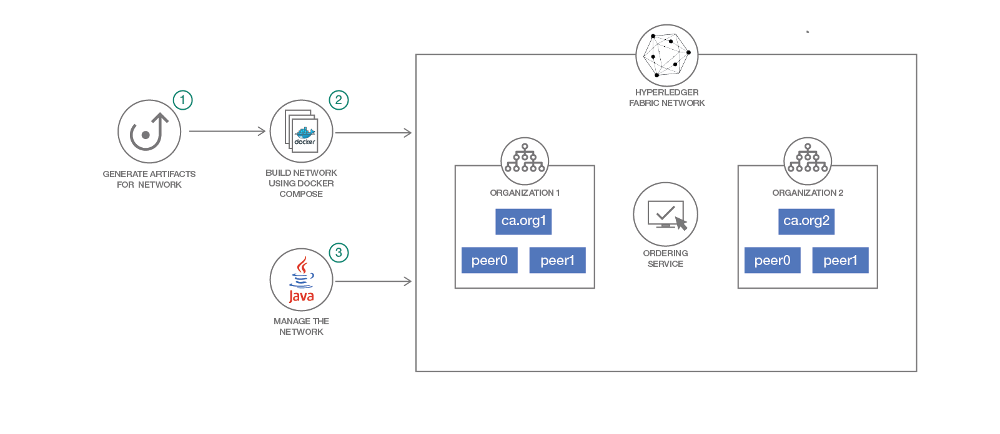

## *** work in progress *** 
# Create and Deploy a Blockchain Network using Hyperledger Fabric SDK Java

Blockchain is a shared, immutable ledger for recording the history of transactions. The Linux Foundation’s Hyperledger Fabric, the software implementation of blockchain IBM is committed to, is a permissioned network. Hyperledger Fabric is a platform for distributed ledger solutions underpinned by a modular architecture delivering high degrees of confidentiality, resiliency, flexibility and scalability. 

In a blockchain application, blockchain network works as a back-end and application has an front-end to communicate with the network. To set up the communication between front-end and back-end, Hyperledger Fabric offers a number of SDKs for a wide variety of programming languages like the Node.js SDK and Java SDKs. This code pattern explains the methodology to create and deploy a blockchain network using fabric sdk java. It would be helpful for the Java developers, who started to look into Hyperledger Fabric platform and would like to use fabric sdk java for their projects. The SDK helps facilitate Java applications to manage the lifecycle of Hyperledger channels and user chaincode. The SDK also provides a means to execute user chaincode, query blocks and transactions on the channel, and monitor events on the channel.

When the reader has completed this pattern, they will understand how to create and deploy a blockchain network using Hyperledger Fabric SDK Java.

## Flow

   

1. Generate the artifacts using cryptogen and configtx for peers and channel in network. Currently these are already generated and provided in the code repository to use as-is.
2. Build the network using docker-compose and generated artifacts.
3. Use Fabric Java SDK APIs to work with the network. 
    * create and initialize the channel
    * install and instantiate the chaincode
    * perform invoke and query to test the network


## Included Components

* [Hyperledger Fabric](https://hyperledger-fabric.readthedocs.io/): Hyperledger Fabric is a platform for distributed ledger solutions underpinned by a modular architecture delivering high degrees of confidentiality, resiliency, flexibility and scalability.

* [Docker](https://www.docker.com/): Docker is an open platform for developers and sysadmins to build, ship, and run distributed applications.

* [Hyperledger Fabric Java SDK](https://github.com/hyperledger/fabric-sdk-java)

## Featured Technologies

* [Blockchain](https://en.wikipedia.org/wiki/Blockchain): A blockchain is a digitized, decentralized, public ledger of all transactions in a network.

* [Java](https://en.wikipedia.org/wiki/Java_(programming_language)): Java is a general-purpose computer-programming language that is concurrent, class-based and object-oriented.

## Watch the Video
TODO

## Steps

Follow these steps to setup and run this code pattern. 

1. [Setup the Blockchain Network](#1-setup-the-blockchain-network)
2. Build the client based on Fabric Java SDK
3. Create and Initialize the Channel
4. Deploy and Instantiate the Chaincode
5. Perform Invoke and Query on network

### 1. Setup the Blockchain Network

* [Clone this repo](https://github.com/IBM/blockchain-application-using-fabric-java-sdk)

To build be the blockchain network, the first step is to generate artifacts for peers and channels using cryptogen and configtx. Utilities used and steps are explained [here](http://hyperledger-fabric.readthedocs.io/en/release-1.0/build_network.html). In this pattern all required artifacts for the peers and channel of the network are already generated and provided to use as-is. Artifacts can be located at:

```
network_resources/crypto-config
network_resources/config
````

The scripts are provided to build the network under `network/` directory. The `network/docker-compose.yaml` file defines the blockchain network topology. This pattern provisions a sample Hyperledger Fabric network consisting of two organizations, each maintaining two peer node, one certificate authority and a solo ordering service. Run the scripts as follows.

```
cd network

# To build the network
./build.sh

# To stop the network
./stop.sh

# To delete the network completely
./teardown.sh
```

### 2. Build the client based on Fabric Java SDK

The previous step creates all required docker images with the required configuration. To work with this network using hyperledger fabric SDK java, perform the following step.

* The java client sources are present in the folder `java` of the repo.
* Open a command terminal and navigate to the `java` directory in the repo. Run the command `mvn install`.
```
cd java
mvn install
```

A jar file `blockchain-java-sdk-0.0.1-SNAPSHOT-jar-with-dependencies.jar` is built and can be found under the `target` folder. This jar can be renamed to `blockchain-client.jar` to keep the name short. 

```
cd target
cp blockchain-java-sdk-0.0.1-SNAPSHOT-jar-with-dependencies.jar blockchain-client.jar
```
Copy this built jar into network_resources directory. This is required as the java code can access required artifacts during execution.
```
cp blockchain-client.jar ../../network_resources
```


### 3. Create and Initialize the Channel

In this code pattern, we create one channel `mychannel` which is joined by all four peers. To create and initialize the channel, run the following command.

```
cd ../../network_resources
java -cp blockchain-client.jar org.app.network.CreateChannel
```

### 4. Deploy and Instantiate the Chaincode

This code pattern uses a sample chaincode `fabcar` to demo the usage of Hyperledger Fabric SDK Java APIs. To deploy and instantiate the chaincode, execute the following command.

> **Note:** The chaincode fabcar.go was taken from the fabric samples available at - https://github.com/hyperledger/fabric-samples/tree/release-1.1/chaincode/fabcar/go.
```
java -cp blockchain-client.jar org.app.network.DeployInstantiateChaincode
```

### 5. Perform Invoke and Query on the Network

Blockchain network has been setup completely. Now we can test the network by performing invoke and query on the network. The `fabcar` chaincode allows us to create a new asset which is a car. For test purpose, invoke operation is performed to create a new asset in the network and query operation is performed to list the assets of the network. Perform the following steps to check the same.

```
java -cp blockchain-client.jar org.app.chaincode.invocation.InvokeQueryChaincode
```

The output of invoke and query should be as shown below.

```
snapshot
```


## Troubleshooting

[See DEBUGGING.md.](DEBUGGING.md)

## License
[Apache 2.0](LICENSE)

